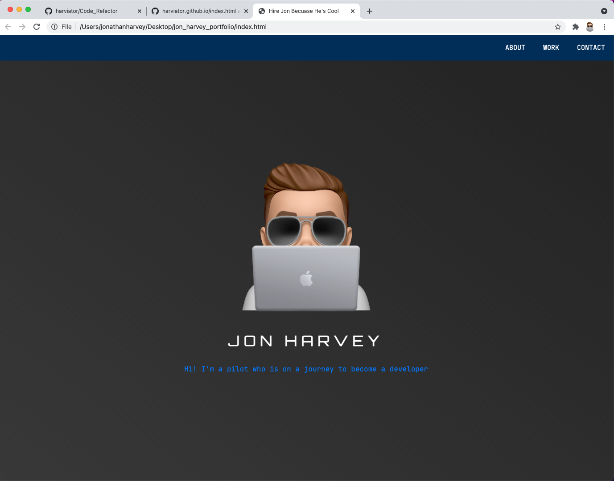

# jon_harvey_portfolio

## Background

Second homework assignment for UofT Bootcamp.  Below is the story and acceptance criteria for reference

## User Story

```
AS AN employer
I WANT to view a potential employee's deployed portfolio of work samples
SO THAT I can review samples of their work and assess whether they're a good candidate for an open position
```

## Acceptance Criteria

```
GIVEN I need to sample a potential employee's previous work
WHEN I load their portfolio
THEN I am presented with the developer's name, a recent photo or avatar, and links to sections about them, their work, and how to contact them
WHEN I click one of the links in the navigation
THEN the UI scrolls to the corresponding section
WHEN I click on the link to the section about their work
THEN the UI scrolls to a section with titled images of the developer's applications
WHEN I am presented with the developer's first application
THEN that application's image should be larger in size than the others
WHEN I click on the images of the applications
THEN I am taken to that deployed application
WHEN I resize the page or view the site on various screens and devices
THEN I am presented with a responsive layout that adapts to my viewport
```

## Implementation

* I started with an HTML skeleton and typical top down approach
* The navbar is fixed to the top and always visible
* In a very ostentatoius manner the page loads with my name and a concise about me description consuming 100% of the view finder
* Next the page goes into a preview of some of my work
* finally the footer acts as a container for my contact information
* With CSS I relied heavily on flexbox and most items are hightlighted when hovered and clicked.
* Thanks to flexbox the page was mostly already responsively designed.  Therefore, I only used one media query to turn the navbar and contact information into a column when the screen width gets low.

## Screen Shot



## Link

https://harviator.github.io/jon_harvey_portfolio/